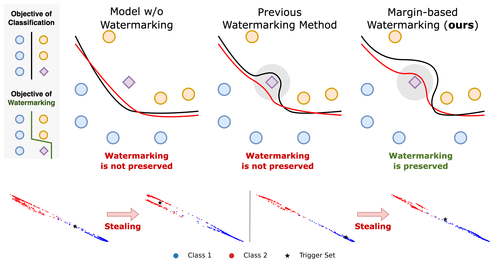

# Margin-based Neural Network Watermarking
> [**Margin-based Neural Network Watermarking**](https://proceedings.mlr.press/v202/kim23o.html) **ICML 2023** <br>
> Byungjoo Kim, Suyoung Lee, Seanie Lee, Sooel Son, Sung Ju Hwang

The official implementation of the paper 'Margin-based Neural Network Watermarking'.


## Abstract
As Machine Learning as a Service (MLaaS) platforms become prevalent, deep neural network (DNN) watermarking techniques are gaining increasing attention, which enables one to verify the ownership of a target DNN model in a black-box scenario. Unfortunately, previous watermarking methods are vulnerable to functionality stealing attacks, thus allowing an adversary to falsely claim the ownership of a DNN model stolen from its original owner. In this work, we propose a novel margin-based DNN watermarking approach that is robust to the functionality stealing attacks based on model extraction and distillation. Specifically, during training, our method maximizes the margins of watermarked samples by using projected gradient ascent on them so that their predicted labels cannot change without compromising the accuracy of the model that the attacker tries to steal. We validate our method on multiple benchmarks and show that our watermarking method successfully defends against model extraction attacks, outperforming relevant baselines.

## Requirments
Python version 3.8 is used. [PyTorch  1.7.1](https://pytorch.org/get-started/previous-versions/) is used, and the additional requirments are in ``requirments.txt``.

## Commands
Training with margin-based watermarking:

```python train.py -dt cifar10 -tt margin -mt res34 -nq 100 --seed {$SEED}```

Experiments on distillation/extraction attacks:

```python distill.py -dt cifar10 -dmt res18 -tmt res34 -tt margin -nq 100```

```python extraction.py -dt cifar10 -dmt res34 -tmt res34 -tt margin -dsrc cifar10 -nq 100```


Available settings:
1. You can change the source dataset for extraction by changing ``-dsrc``.
2. You can change the extraction attack from soft to hard by decommenting lines 58-59 in ``extraction.py``.
3. All the experiments can be tagged by using ``-msg`` and ``-admsg`` arguments.


## Citation
```latex
@InProceedings{pmlr-v202-kim23o,
  title = 	 {Margin-based Neural Network Watermarking},
  author =       {Kim, Byungjoo and Lee, Suyoung and Lee, Seanie and Son, Sooel and Hwang, Sung Ju},
  booktitle = 	 {Proceedings of the 40th International Conference on Machine Learning},
  pages = 	 {16696--16711},
  year = 	 {2023},
  editor = 	 {Krause, Andreas and Brunskill, Emma and Cho, Kyunghyun and Engelhardt, Barbara and Sabato, Sivan and Scarlett, Jonathan},
  volume = 	 {202},
  series = 	 {Proceedings of Machine Learning Research},
  month = 	 {23--29 Jul},
  publisher =    {PMLR},
  pdf = 	 {https://proceedings.mlr.press/v202/kim23o/kim23o.pdf},
  url = 	 {https://proceedings.mlr.press/v202/kim23o.html},
  abstract = 	 {As Machine Learning as a Service (MLaaS) platforms become prevalent, deep neural network (DNN) watermarking techniques are gaining increasing attention, which enables one to verify the ownership of a target DNN model in a black-box scenario. Unfortunately, previous watermarking methods are vulnerable to functionality stealing attacks, thus allowing an adversary to falsely claim the ownership of a DNN model stolen from its original owner. In this work, we propose a novel margin-based DNN watermarking approach that is robust to the functionality stealing attacks based on model extraction and distillation. Specifically, during training, our method maximizes the margins of watermarked samples by using projected gradient ascent on them so that their predicted labels cannot change without compromising the accuracy of the model that the attacker tries to steal. We validate our method on multiple benchmarks and show that our watermarking method successfully defends against model extraction attacks, outperforming recent baselines.}
}
```